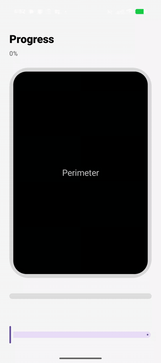
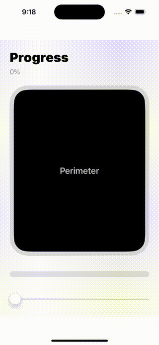

# Perimiter Progress Bar

Reusable progress bar components extracted from the Adverse iOS and Android apps.

This library was written with OpenAI Codex. It provides a seekable perimeter progress bar that can wrap around another component.

## Repository Structure

- `Package.swift` - root Swift Package manifest for the iOS/macOS library product `AdverseProgress`.
- `build.gradle.kts`, `settings.gradle.kts`, `gradlew` - root Android publishing project; the Android library is exposed as Gradle module `:android`.
- `library/android` - Android library source, package `one.adverse.progress`.
- `library/android/src/test` - Android unit tests for seekable perimeter behavior.
- `library/ios/Sources/AdverseProgress` - SwiftUI library source.
- `library/ios/Tests/AdverseProgressTests` - Swift Package tests for seekable perimeter behavior.
- `sample/android` - runnable Android sample app that consumes `library/android` as a local module.
- `sample/ios` - runnable iOS SwiftUI sample app that compiles the local library sources.
- `docs/media` - README demo videos and GIF previews.

## Components

- Android `PerimeterProgressBar` - Jetpack Compose rounded-rectangle perimeter progress.
- Android `RectProgressBar` - Jetpack Compose rounded horizontal fill progress.
- Android `Modifier.seekablePerimeterProgress` - tap and drag seeking around the perimeter.
- iOS `PerimeterProgressBar` - SwiftUI rounded-rectangle perimeter progress.
- iOS `LinearFillProgressBar` - SwiftUI rounded horizontal fill progress.
- iOS `View.seekablePerimeterProgress` - tap and drag seeking around the perimeter.

## Demos

The sample apps support tap and drag seeking on the perimeter and linear bars. These previews show dragging around the perimeter path.

### Android



[Full Android mp4](docs/media/android-perimeter-drag.mp4)

### iOS



[Full iOS mp4](docs/media/ios-perimeter-drag.mp4)

## Android

After the Android artifact is published to Maven Central:

```kotlin
repositories {
    google()
    mavenCentral()
}

dependencies {
    implementation("one.adverse:perimeter-progress:1.0.0")
}
```

Use the components from package `one.adverse.progress`.

```kotlin
import one.adverse.progress.PerimeterProgressBar
import one.adverse.progress.RectProgressBar
import one.adverse.progress.seekablePerimeterProgress

PerimeterProgressBar(
    progress = 0.42f,
    strokeWidth = 8.dp,
    cornerRadius = 32.dp,
    color = Color(0xFF10A37F),
    modifier = Modifier
        .fillMaxWidth()
        .height(420.dp)
)

Box(
    modifier = Modifier
        .fillMaxWidth()
        .height(420.dp)
        .seekablePerimeterProgress(
            progress = progress,
            strokeWidth = 8.dp,
            cornerRadius = 32.dp,
            perimeterStart = 0.66f,
            onSeek = { progress = it }
        )
) {
    PerimeterProgressBar(
        progress = progress,
        strokeWidth = 8.dp,
        cornerRadius = 32.dp,
        perimeterStart = 0.66f,
        modifier = Modifier.fillMaxSize()
    )
}

RectProgressBar(
    progress = 0.72f,
    color = Color(0xFF10A37F),
    modifier = Modifier
        .fillMaxWidth()
        .height(12.dp)
)
```

Run the Android sample:

```sh
cd sample/android
./gradlew :app:installDebug
```

## iOS

Add the Swift package from GitHub:

```swift
.package(url: "https://github.com/snooplsm/perimeter-progress.git", from: "1.0.0")
```

Then import the product:

```swift
import SwiftUI
import AdverseProgress

PerimeterProgressBar(
    progress: 0.42,
    color: Color(red: 0.0627, green: 0.6392, blue: 0.498),
    lineWidth: 8,
    cornerRadius: 32
)
.frame(height: 420)
.seekablePerimeterProgress(
    progress: $progress,
    lineWidth: 8,
    cornerRadius: 32,
    perimeterStart: 0
)

LinearFillProgressBar(
    progress: 0.72,
    color: Color(red: 0.0627, green: 0.6392, blue: 0.498)
)
.frame(height: 12)
```

Run the iOS sample:

```sh
open sample/ios/AdverseProgressSample.xcodeproj
```

Then choose an iOS simulator and run the `AdverseProgressSample` scheme from Xcode.

From the command line:

```sh
xcodebuild \
  -project sample/ios/AdverseProgressSample.xcodeproj \
  -scheme AdverseProgressSample \
  -configuration Debug \
  -sdk iphonesimulator \
  -destination 'generic/platform=iOS Simulator' \
  build
```

## Notes

- `progress` is clamped to `0...1` on both platforms.
- Perimeter progress supports wraparound when `perimeterStart + progress > 1`.
- Seekable perimeter progress clamps drag gestures at the wrap seam so a held drag cannot jump from `>=90%` to `0%`, or from `<10%` to `100%`.
- The perimeter path starts on the right edge by default on iOS. Android follows Compose `Path.addRoundRect` path ordering and exposes `perimeterStart` for positioning.
- App-specific state, warnings, video timers, and Adverse theme dependencies were removed.
